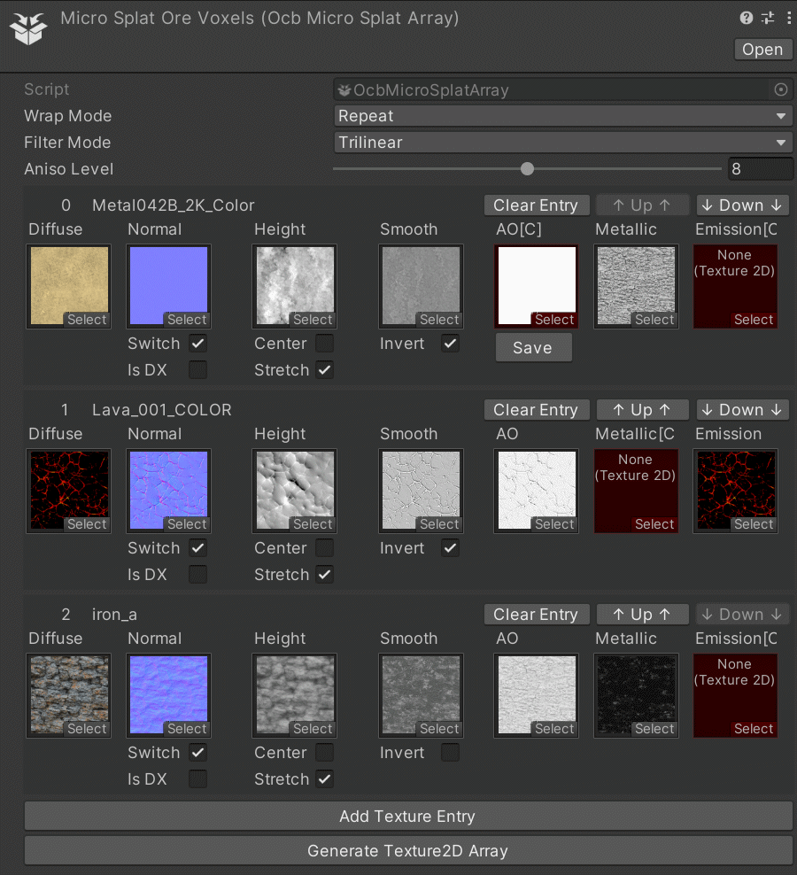

# OCB MicroSplat Shader Mod - 7 Days to Die (V1.0) Addon

Replacing vanilla terrain MicroSplat shader with an improved version.

You need to disable EAC to use this mod!

[![GitHub CI Compile Status][6]][5]

## Description

It is still the same base [MicroSplat][4] shader, but I've added e.g.
the anti-tiling module for better visual fidelity. It will also
allow me to open up the shader to use 32 textures instead of 24.
Currently 3 different performance/quality settings are included,
which are automatically switched with the in-game terrain quality.

## Download and Install

End-Users are encouraged to download my mods from [NexusMods][3].  
Every download there helps me to buy stuff for mod development.

Otherwise please use one of the [official releases][2] here.  
Only clone or download the repo if you know what you do!

## Creating texture atlas for MicroSplat

In order to use this mod, you need to pass it the required textures
in a compatible format. To ease this process, I've created a unity
tool that should help with that. Export the resulting texture2d
arrays and reference them in the worldglobal.xml. You may check
the [OcbMicroSplatOreVoxel][7] demo for a fully working example.



Package: https://github.com/OCB7D2D/UnityMicroSplatArrayPacker.git#upm@master

### Demo Mods for advanced features

Check xml config and unity projects for these mods:

- https://github.com/OCB7D2D/OcbMicroSplatOreVoxels (Custom Ores)
- https://github.com/OCB7D2D/OcbMicroSplatTestBiomes (Custom Biomes)
- https://github.com/OCB7D2D/OcbMicroSplatSnow (Extend existing Biome)
- https://github.com/OCB7D2D/OcbMicroSplatRoads (Replace Textures)

### Helper Mods to adjust some settings in-game

Download from https://github.com/OCB7D2D/OcbMicroSplatHelper/releases

## MicroSplat Explanation for interested Modders

NOTE: Docs below are in a very poor first draft version!

As we use original MicroSplat shaders you'll need to understand
how it works and how to configure it at least to some extend.

https://assetstore.unity.com/packages/tools/terrain/microsplat-96478

The shader is very optimized and therefore requires some pre-baked
inputs/textures to work correctly. This mod will allow you to turn
pretty much every knob the microsplat shader offers and will bake the
required textures, once a map is loading, to determine what is used.

### Generic description how MicroSplat works

7D2D uses the procedural texturing addon for MicroSplat. This will be
the most important part to adjust and customize biomes. It is highly
recommended to at least watch the introduction video in the unity store:

https://assetstore.unity.com/packages/tools/terrain/microsplat-runtime-procedural-texturing-143039

This should explain some of the core concepts involved, like biome layers.

#### How does MicroSplat blend terrain textures

MicroSplat shader will determine the 4 most weighted textures via various
means (see below). Those 4 textures will then blend according to final
weight value (can be influenced by slope or height). Additional textures
after the 4 most weighted ones will simply be ignored. This is important
to remember, as it can lead to sharp cuts in the blend if texture weight
switch place in the weight order (similar to z-fighting). To avoid this
you can try to keep potential textures to choose from low. Therefore it
is somewhat recommended to not use more than 2 or 3 texture per biome.

#### Main weight determination via splatmaps

The first and most important condition where to render what texture, is
stored and read via splatmap textures (`splat3.png` and `splat4.png`).
These determine the 8 main potential core biomes. Every png holds four
color channels, one for each biome, so `splat3.png` red channel is biome 1,
while `splat4.png` blue channel is biome 7. To add more/custom biomes you
need to assign them a certain color and prepare the splatmaps accordingly.

There is currently no automated way to do this beside editing the pngs
directly. Make sure colors are all distinct. You may find help on how
to do this on guppys discord. It's the same as editing biomes before.

#### What are Biome Layers

The Biome layers is a core concept of MicroSplat shader you will need to
understand in order to create you own custom biome configs. Here it can
help if you first try the free MicroSplat in unity directly. The concepts
should transfer 1to1 to the required xml config that you will need to
provide to this mod for best results.

##### How does it all work in the shader

As a basic comparison you can think of biome layers like a stack of
photoshop layers, where the layer settings define how much a layer
is applied to the end result. The shader will actually go through all
biome layers for each vertex and pixel. This loop will select the four
most weighted layers and passes them on to be rendered.

##### Determining layers weights via biome splatmaps

Each biome layer has 8 parameters that determine for which biome that
layer should be considered. Those are internally stored as 2 `Vector4`
objects, which correspond directly to `splat3.png` and `splat4.png`.

E.g. to enable a biome layer for biome 6 (splat4 green channel):

```xml
    <property name="biome-weight-6" value="1.0"/>
```

### Patching MicroSplat texture 2d array

Each biome layer references a specific texture in the texture array.
For a custom texture the config will look something like this:

```xml
    <microsplat-texture name="custom3">
        <!-- Green Terrain -->
        <property name="Diffuse" value="#@modfolder:Resources/TestBiomes.unity3d?TestBiomes_diff_tarray[2]"/>
        <property name="Normal" value="#@modfolder:Resources/TestBiomes.unity3d?TestBiomes_norm_tarray[2]"/>
        <property name="Specular" value="#@modfolder:Resources/TestBiomes.unity3d?TestBiomes_shao_tarray[2]"/>
        <!-- <property name="SwitchNormal" value="true"/> -->
        <property name="SplatUVScale" value="3,3"/>
    </microsplat-texture>
```

Later in the `biome-layer` config you can reference it:

```xml
    <property name="microsplat-texture" value="custom3"/>
```

To Document:

- SwitchNormal
- SplatUVScale

### Vanilla Biome Layers setup

Vanilla uses 5 biomes and has 12 biome layers:

```
Executing command 'msplat layers'
Layer 0 => (1.00, 0.00, 0.00, 0.00)/(0.00, 0.00, 0.00, 0.00) #19
Layer 1 => (1.00, 0.00, 0.00, 0.00)/(0.00, 0.00, 0.00, 0.00) #0
Layer 2 => (0.00, 1.00, 0.00, 0.00)/(0.00, 0.00, 0.00, 0.00) #19
Layer 3 => (0.00, 1.00, 0.00, 0.00)/(0.00, 0.00, 0.00, 0.00) #2
Layer 4 => (0.00, 0.00, 1.00, 0.00)/(0.00, 0.00, 0.00, 0.00) #10
Layer 5 => (0.00, 0.00, 1.00, 0.00)/(0.00, 0.00, 0.00, 0.00) #19
Layer 6 => (0.00, 0.00, 0.00, 1.00)/(0.00, 0.00, 0.00, 0.00) #10
Layer 7 => (0.00, 0.00, 0.00, 1.00)/(0.00, 0.00, 0.00, 0.00) #8
Layer 8 => (0.00, 0.00, 0.00, 0.00)/(1.00, 0.00, 0.00, 0.00) #7
Layer 9 => (0.00, 0.00, 0.00, 0.00)/(1.00, 0.00, 0.00, 0.00) #20
Layer 10 => (0.00, 0.00, 0.00, 0.00)/(1.00, 0.00, 0.00, 0.00) #12
Layer 11 => (0.00, 0.00, 0.00, 0.00)/(1.00, 0.00, 0.00, 0.00) #11
```

It uses distinct layers per biome, which is not strictly necessary.
Output above can be summarized as (`#XY` suffix is the texture index):

- Biome 1 uses layer 0 and 1
- Biome 2 uses layer 2 and 3
- Biome 3 uses layer 4 and 5
- Biome 4 uses layer 6 and 7
- Biome 5 uses layer 8,9,10 and 11

If you want to re-use a vanilla layer for your own custom biome, you
really just need to adjust the `biome-weight-x` option. This will
enable the biome layer to also be active on another splatmap channel.

### Patching Biome Layer configurations

```xml
<biome-layer name="biome6a">
    <!-- Main/Absolute layer weight -->
    <property name="weight" value="1.0"/>
    <!-- Enable/Disable/Configure noise -->
    <property name="noise-active" value="false"/>
    <property name="noise-frequency" value="1.0"/>
    <property name="noise-offset" value="0.0"/>
    <property name="noise-range" value="0.0,1.0"/>
    <!-- Disable/Enable certain features -->
    <property name="height-active" value="false"/>
    <property name="slope-active" value="false"/>
    <!-- Index into MicroSplat Texture2DArray -->
    <property name="microsplat-texture" value="custom1"/>
    <!-- Defines what biome color layer reacts to -->
    <property name="biome-weight-6" value="1.0"/>
    <!-- Curve, BoostFilter, HighPass, LowPass, CutFilter -->
    <property name="height-curve-mode" value="Curve"/>
    <property name="slope-curve-mode" value="Curve"/>
</biome-layer>
```

#### How to setup animation curves

You can define custom curves for slope and height procedural rendering.
These options correspond 1to1 to options with MicroSplat procedural
texturing addon. If you really want to experiment with all these setting
I can recommend to buy the 20$ addon to play with the options in unity
directly. Otherwise you can use my helper mod to play with these in-game.

```xml
    <property name="slope-active" value="True"/>
    <property name="slope-curve-mode" value="Curve"/>
    <slope-keyframes>
        <keyframe time="0.025" value="0.0"/>
        <keyframe time="0.2" value="1.0"/>
    </slope-keyframes>
```

Underlying the curves are rendered with unity on-board methods.
It may help if you get yourself familiar with this unity feature:

https://docs.unity3d.com/ScriptReference/AnimationCurve.html

#### How is the final weight value calculated

Unfortunately I can't really give you a final answer here, but the biome
splat-map certainly seems to be "on or off". Per biome layer weight seems
to be mixed with noise, slop and height curves. This part is really left
open for interested modders to further explore.

### Patching old Terrain texture atlas

In order for full support I also had to patch old terrain texture atlas.
This may mean that the config you do here will also work as is for legacy
distant terrain mod. Falling block entities are also rendered with this.

### Custom Ore/Voxel Textures

In order for voxels (specific blocks) to have custom terrain rendering,
the need to use "voxel textures". It's a term I use myself in order to
distinguish between textures solely used by biome layers. Biome layer
textures can use the full range of the texture 2d array atlas. On the
other hand, voxel textures can only occupy certain texture indexes.

For the shader to know which voxel texture should overload a regular
terrain texture, as determined by the splatmaps, is the UV information
per vertex. We have 4 `vector2` UVs per vertex available. Vanilla uses
these 8 parameters to address textures 16 to 24. I enabled the shader
to also hold additional 8 parameters in the same `texcoord[0-4]` data.
This enabled the full 32 textures to address, with 16 available for
custom ore voxels (as 16 are being used by vanilla of course).

Given that this info is hold at the vertex level, custom ores/voxels
are only rendered at detail terrain and not for distant terrain. That's
just how the shader works and certainly a good tradeoff for performance.

## Changelog

### Version 0.9.5

- Fix sub-biomes with custom textures
- Add fix for loading very large maps 
- Recompile for 7D2D V1.2 stable

### Version 0.9.4

- Adjust phong factor for tessellation
- Add potential fix for prefab editor

### Version 0.9.3

- Recompile for 7D2D V1.1 stable

### Version 0.9.2

- Properly hook world load and unload events for MicroSplat
- Revert to previous transpiler patch (fix `Log.Out` issue)
- Add warning if processed splatmaps are not found

### Version 0.9.1

- Fix XML-Patcher for V1 compatibility
- Add emission and metallic texture support
- Remove obsolete metallic-per-texture setting
- Fix potential NRE when unloading textures
- Verified compatibility with V1.0 (b333)

### Version 0.9.0

- First compatibility with V1.0 (exp)
- Potential fix for texture load issue

### Version 0.8.0

- Add UI option for terrain tessellation
- Add separate tessellation shader variant

### Version 0.7.1

- Remove superfluous debug message

### Version 0.7.0

- Add geometry/vertex tessellation

### Version 0.5.3

- Adjust weird vertex normals edge-case
- Disabled custom shader in prefab editor

### Version 0.5.2

- Fix weird vertex normals edge-case
- Add map filter for microsplat shader configs
- Add `SplatUVOffset` (per texture) setting

### Version 0.5.1

- Fix issue with custom voxel blocks swapping textures
- Fix transpiler patch not working sometimes (DF)

### Version 0.5.0

- Add new advanced MicroSplat features
- Add simple templating for XML includes
- Fix topsoil previews to use proper texture
- Fix textures of falling blocks by patching old atlas
- Fix shader not being assigned after world reload
- Add per texture smoothness flag to shader options
- Update asset bundle to strip more shaders variants
- Adjust biome-weight XML API for biome-layer
- Implement loading of metal shaders for MacOSX

### Version 0.2.0

- Update compatibility for 7D2D A21.0(b313)
- Implement new advanced MicroSplat features
- Support for custom biomes and ore voxel blocks
- Add support for Mac OSX Metal shaders (testing)

### Version 0.1.3

- Replace broken decals shader with own implementation
- Improve MicroSplat shader on high and ultra quality
- Distance material resampling is now less aggressive

### Version 0.1.2

- Fix issue when changing options without game loaded

### Version 0.1.1

- Fix normals and noise

### Version 0.1.0

- Initial version

[1]: https://github.com/OCB7D2D/OcbMicroSplat
[2]: https://github.com/OCB7D2D/OcbMicroSplat/releases
[3]: https://www.nexusmods.com/7daystodie/mods/2873
[4]: https://assetstore.unity.com/packages/tools/terrain/microsplat-96478
[5]: https://github.com/OCB7D2D/OcbMicroSplat/actions/workflows/ci.yml
[6]: https://github.com/OCB7D2D/OcbMicroSplat/actions/workflows/ci.yml/badge.svg
[7]: https://github.com/OCB7D2D/OcbMicroSplatOreVoxels